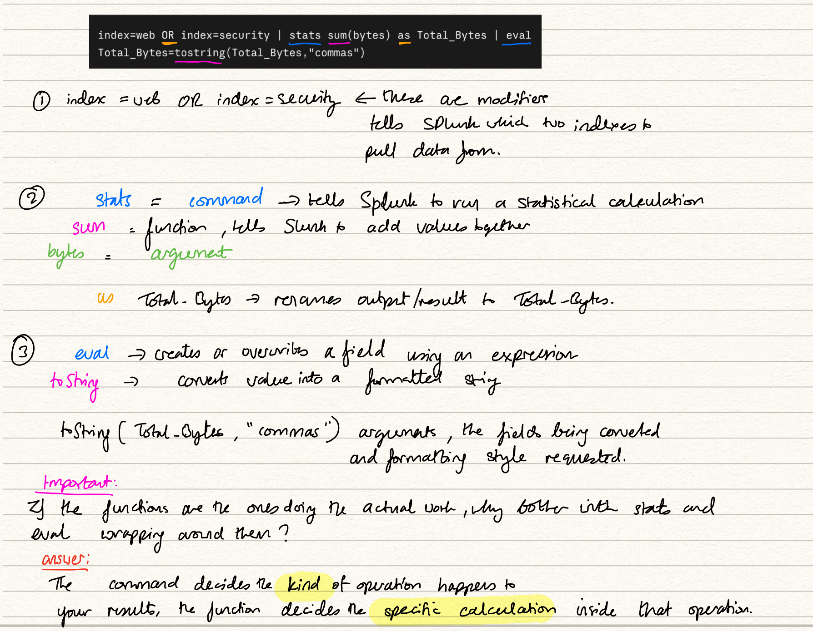
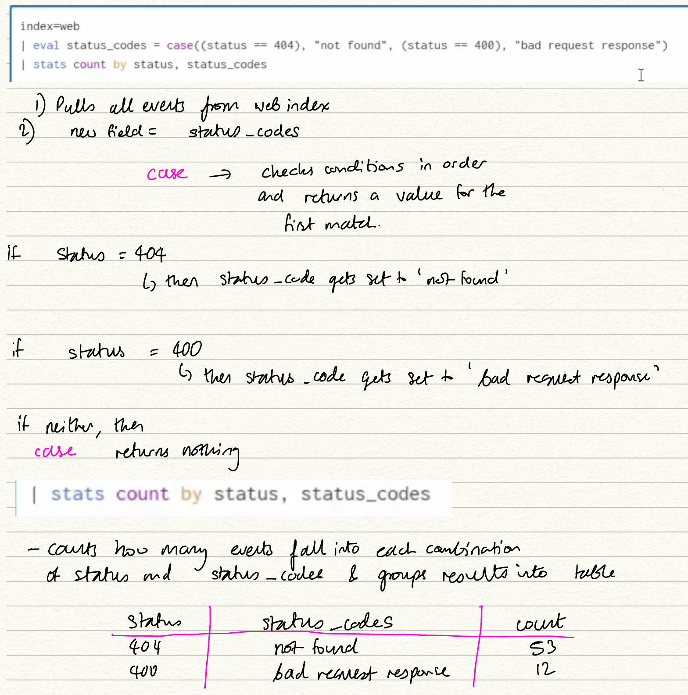
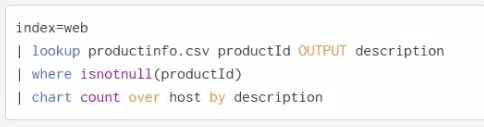

# Splunk Power User: Course Notes

Personal study notes taken while working through a Splunk Power User certification course. Structured module by module, with demo walkthroughs merged into the relevant sections.

## Contents

- [Introducing Splunk](#introducing-splunk)
- [Mod 2: Core Components and Deployment Types](#mod-2-core-components-and-deployment-types)
- [Clustering Explained](#clustering-explained)
- [Data Pipeline](#data-pipeline)
- [Apps vs AddOns](#apps-vs-addons)
- [Basics of Searching](#basics-of-searching)
- [Knowledge Objects](#knowledge-objects)
- [Mod 7: Fields](#mod-7-fields)
- [Search Processing Language (SPL)](#search-processing-language-spl)
- [Mod 9: Transforming Commands](#mod-9-transforming-commands)
- [Mod 10: Transaction Command](#mod-10-transaction-command)
- [Mod 11: Manipulating Your Data (eval, where, search)](#mod-11-manipulating-your-data-eval-where-search)
- [Mod 12: Fields, Part Two](#mod-12-fields-part-two)
- [Mod 13: Lookups](#mod-13-lookups)
- [Mod 14: Visualizing Your Data](#mod-14-visualizing-your-data)
- [Mod 15: Visualization Commands](#mod-15-visualization-commands)
- [Mod 16: Reports and Drilldowns](#mod-16-reports-and-drilldowns)
- [Mod 18: Tags and Event Types](#mod-18-tags-and-event-types)
- [Mod 19: Macros](#mod-19-macros)
- [Mod 20: Workflow Actions](#mod-20-workflow-actions)
- [Mod 21: Data Normalization and Troubleshooting](#mod-21-data-normalization-and-troubleshooting)
- [Mod 22: Data Models](#mod-22-data-models)
- [Mod 25: Common Information Model (CIM)](#mod-25-common-information-model-cim)

---

## Introducing Splunk

**SIEM** stands for Security Information and Event Management. Splunk is a network analysis tool that serves as a platform for conducting big data analytics.

### What does it do?

- **Data analytics**: gives metrics across all your data
- **Data ingest**: acts as a data parser and organiser, for both unstructured and structured data
- **Visual display**: creates graphs, charts, interactive GUIs, and generates reports
- **Insight** into security intelligence, business operations, and identities

### SPL (Search Processing Language)

- Learn how to use SPL
- **Network traffic analysis**: review alerts, create signatures, build searches to check traffic patterns, query for indicators
- **Visualise the data**: build dashboards, create graphs and pie charts, display graphical information, generate reports

### What makes up Splunk

- **Forwarders**: the sender of data. Lives on the machine and feeds raw data to the indexer.
  - Universal forwarder
  - Heavy forwarder
  - Intermediary forwarder
- **Indexers**: process your data, store your events, hold the raw data.
  - A **bucket** is a stored directory of data that lives on the indexer, grouped by the time of the events
- **Search heads**: allow you to query and search your environment.
  - Searching by time is one of the most efficient delimiters to set, as it tells the indexer where to pull the data from on disk
  - This is where you write SPL, interfacing with the indexers

---

## Mod 2: Core Components and Deployment Types

### The big three components

**Forwarder** collects raw logs from the machine it sits on and sends (forwards) them to an indexer. There are three types (universal, heavy, intermediary), but for Power User certification purposes you just need the general term "forwarder."

**Indexer** receives the raw data and processes it into searchable form. Useful analogy from the transcript: think of an indexer as a page. Data gets written top to bottom, one line at a time, until the page is full. Each time the forwarder sends data, it takes up the next line.

Indexers organise events into **buckets**, which are stored directories of data on the indexer, grouped by the time of the events.

**Search head** is your main interface for querying data. You write your SPL here, run the search, and the search head sends that request off to the indexers holding the relevant data.

Example: searching `index=main` on the search head sends the request to whichever indexer holds the `main` index data.

**Why time matters**: because events are stored in time groupings, time is the most efficient filter you can set in a search. It tells the indexer exactly where to pull data from on disk rather than scanning the whole "page."

### Three deployment types

**Standalone (single instance)**
One Splunk instance doing everything. Acts as both search head and indexer, handling searches and data processing. No real need for forwarders since inputs are configured directly on that one machine. Downloading Splunk onto your own laptop is the classic example, and this is what the course demos use (monitor inputs for local logs, plus uploaded data files).

**Basic**
Forwarders are now installed on remote machines and send data back to the Splunk server. The Splunk server is still both search head and indexer, but inputs are handled by forwarder agents out in the environment. A simple step up from standalone.

**Multi-instance**
How most companies run Splunk in large production environments. The key idea is **functional separation**: search heads only search, indexers only index, forwarders only forward. Roles can be merged in practice, but that is an architect-level discussion.

### Clustering (summary)

**Search head clustering** increases search capacity and lets users share resources and knowledge objects. Rules to note:

- Each search head should be a one-for-one replica of the others
- Minimum of three search heads required
- A **deployer** is the tool used to manage a search head cluster

**Indexer clustering** increases data availability through data replication, governed by a **replication factor** (how many copies of the data are kept). If one indexer goes down, no data is lost because another indexer holds the same data.

**Deployment server** is what you use to manage forwarders at scale, for example if you have hundreds of them across your environment.

---

## Clustering Explained

### What "clustering" actually means

A cluster is multiple Splunk machines doing the same job, working as a coordinated group instead of as individuals.

Two reasons you would want that:

1. **More capacity.** Two machines can handle more work than one.
2. **Redundancy.** If one machine dies, the others carry on and nothing is lost.

Search head clustering mostly gives you the first. Indexer clustering mostly gives you the second.

### Search head clustering

#### The problem it solves

In a small environment you have one search head, and every user logs into that same box to run searches. That works fine until:

- Too many people are searching at once and the machine slows to a crawl
- The machine goes down, and now nobody can search anything

Clustering fixes both. You stand up several search heads, users get spread across them, and losing one is not a disaster.

#### Why they must be identical replicas

If you build a saved search on Search Head 1, and a colleague logs into Search Head 2, they need to see that saved search too. Otherwise the cluster feels like three separate Splunk installs that happen to be near each other.

So the cluster **replicates knowledge objects** between all members automatically.

> **Knowledge object** is Splunk's umbrella term for anything you create that helps interpret or reuse data. Saved searches, reports, dashboards, alerts, field extractions, lookups, tags, event types, macros. Basically the configuration layer you build on top of raw data.

Think of it like a shared team drive. It should not matter which laptop you sit down at, the files are the same.

#### Why the minimum is three

Search head clusters elect a **captain**, one member that coordinates the group (schedules saved searches so they do not run three times, decides who replicates what, tracks cluster state).

Electing a captain requires a **majority vote**. With three members, two can still form a majority if one dies. With two members, losing one leaves a single node that cannot outvote anything, and the cluster stops functioning properly.

Three is the smallest odd number that survives one failure. That is the whole reason for the rule.

#### The deployer

The deployer is a separate Splunk instance that pushes configuration and apps out to the search head cluster members.

You do not log into each search head and edit its config individually. That defeats the point of identical replicas. Instead you put the config on the deployer, tell it to distribute, and it sends the same bundle to every member.

Important detail: **the deployer is not part of the cluster.** It sits outside and manages it, like a delivery driver who is not a member of the household.

### Indexer clustering

#### The problem it solves

Indexers hold your actual data on disk. If an indexer dies and its data only lived on that one machine, that data is gone. Not slow, not degraded. Gone.

Indexer clustering solves this by keeping copies of every bucket on more than one indexer.

#### Replication factor

The **replication factor** is the number you set that says: how many total copies of each bucket should exist across the cluster?

- A replication factor of 3 means every bucket exists on three different indexers
- If one indexer goes down, two copies remain, and the cluster automatically makes a fresh third copy on a surviving indexer to get back to three

This is why no data would be lost. The data was never only in one place.

#### Search factor

There is a companion setting called the **search factor**: how many of those copies are _searchable_ copies rather than just raw backups.

Searchable copies include the index files that make searching fast, so they take up more disk. Raw copies are smaller but need processing before they can be searched. Search factor is always equal to or lower than replication factor.

#### The cluster manager

Just as search head clusters have a deployer, indexer clusters have a **cluster manager** (older docs call it the master node). It tracks which buckets live where, tells indexers to make new copies when one fails, and tells search heads which indexers to query.

### Deployment server

This is for the **forwarders**, and it is a completely separate thing from the deployer despite the similar name.

Picture 500 servers across a company, each running a forwarder. Each forwarder needs to know what logs to collect and where to send them. Configuring 500 machines by hand is not realistic, and updating them later is worse.

The deployment server lets you define configuration centrally and push it out. Forwarders check in with it periodically and pull down whatever config applies to them. You can group forwarders (all Windows servers get this config, all Linux web servers get that one) so the right settings land in the right places.

### The three management servers, side by side

| Component             | What it manages     | What it pushes                            |
| --------------------- | ------------------- | ----------------------------------------- |
| **Deployer**          | Search head cluster | Apps and configs to search head members   |
| **Cluster manager**   | Indexer cluster     | Coordinates bucket copies and replication |
| **Deployment server** | Forwarders          | Inputs and configs to forwarder agents    |

Deployer and deployment server are the pair most likely to get mixed up. The memory hook: **deployER goes to search hEads. Deployment SERVER goes to forwarders.** Not elegant, but it sticks.

---

## Data Pipeline

**Flow:** Input (streams) → Parsing (events) → Indexing (disk)

### Input phase

Data arrives as streams. Sources include forwarders (agents that ship logs to Splunk), uploads, monitors, HTTP Event Collector, local log files, and network/port traffic. Nearly anything can feed into the SIEM.

### Parsing phase

Handled by the indexer.

1. Streams are converted into events (individual records).
2. License usage is checked against your daily data volume allowance.

### Indexing phase

Data is indexed, compressed, and written to disk. Now searchable.

### Metadata fields

- **Source**: full file path, where the data was collected from
- **Host**: which machine sent the data (example used: web1 to web4)
- **Sourcetype**: format label controlling how data displays as events. Getting this right matters a lot, a wrong choice leads to poorly parsed data.

---

## Apps vs AddOns

### App

A GUI based front end that changes your workstation view for working with data. Lives mainly on the search head, shows up in the App dropdown menu.

Examples: AWS, Azure, Corelight.

Premium versions exist too: Enterprise Security (for SOC use), SOAR/Phantom, UBA, ITSI.

### AddOn / TA (Technology AddOn)

Runs in the background, no GUI. Usually vendor specific, handles things like onboarding data, formatting it correctly, or mapping it to the SIEM through scripts, configs, or APIs.

Can live on indexers, the search head, or a heavy forwarder.

Examples: CrowdStrike, Juniper, Unix/Linux, Palo Alto.

### Key points

- A vendor can have both an App and an AddOn at once (example: CrowdStrike has an App plus separate AddOns for Intel indicators and Falcon event streams)
- Splunkbase hosts thousands of both, and you can build and publish your own
- People mix up the terms constantly in practice, that is normal
- A supported App or TA used to onboard data should automatically map to the SIEM

### Quick recall

- App = GUI, front end, search head
- AddOn/TA = background, vendor specific, functionality

---

## Basics of Searching

### Time picker

Set the search time range via presets, relative, real time, or custom date ranges. Can get more granular with specific time ranges and advanced options.

### Search modes

- **Fast**: fewer fields, pulls less data from disk
- **Smart**: checks if a transforming command is present, then runs fast or verbose accordingly
- **Verbose**: full fields and values, most data pulled from disk. Used most often for visibility.

### Results view

- Events load into a timeline, broken into one hour columns. Bar width reflects the time picker range.
- Total event count shown after the search completes
- **Job Inspector**: shows search performance, covered later
- Can pause, stop, export, share, or save searches (as reports or alerts)
- **Event sampling**: limits the sample pulled back
- Can zoom the timeline by dragging to highlight a range, which updates the time picker

### Fields

- The left side field menu shows all fields and values across returned events
- Clicking a raw event expands it to show fields and values for that single event
- Clicking a field value can add it to the search

### Working with fields in search

- Highlighting a raw string value lets you add it to the search (matches as a plain string) or exclude it
- Better practice: search the field name plus value directly (for example `method=GET`), since Splunk matches the field, which is less taxing than a raw string match

### Boolean and comparison operators

- **OR**: matches across multiple values, for example `index=web OR index=security`
- **equals / does not equal**: filters field values directly
- **Greater than, less than, greater than or equal to, less than or equal to**: used on numeric fields, for example `bytes>268`

### Important gotcha: NOT vs does not equal

`action!=purchase` and `NOT action=purchase` return different event counts. NOT returns everything unrelated to that exact condition, so the result set is broader. The two are not equivalent even though they sound similar.

### Wildcards

Splunk supports wildcard expressions, for example `fail*` matches both fail and failed. Convenient, but wildcards are taxing on performance. Becomes less necessary as SPL skills improve.

### Other buttons

- Messages (system health notices)
- Settings (configurations and preferences, including time values and editor settings)

---

## Knowledge Objects

### What is a KO?

Anything built or created in Splunk for analysis. Examples: an alert (like flagging 50 sales in a day), a tag (like marking logins to web server 2 in green). Rule of thumb: if you built it, it is probably a KO.

### Why they matter

KOs are searchable by all users and can be reused as persistent objects. Sharing them across a team boosts collaboration and strengthens SIEM usage overall.

### Knowledge Manager

The role responsible for overseeing KO creation, sharing, and performance. Per Splunk docs, this person provides centralized oversight and maintenance of KOs, ensuring things like saved searches, tags, field extractions, and lookups are shared with the right people.

### Naming convention

Recommended structure: group name, then object type, then short description.

Example: a SOC team building an alert might name it `SOC_alert_[description of what it fires on]`.

### Permissions

- **Private**: only the creator can see or use it
- **App only**: persists within the app it was created in
- **All apps**: available globally across all apps
- The owner can adjust read/write permissions

### Throttling

If six alerts fire in one minute, throttling means you only get notified once.

---

## Mod 7: Fields

### What are fields?

Key value pairs made up of a field name and a field value. Field names are case sensitive when searching, field values are not.

### Search behaviour

- Can search by single or multiple field names
- Can exclude fields using Boolean operators
- If no operator is set, Splunk defaults to AND
- Splunk auto recognizes fields based on the sourcetype, so choosing the right AddOn during onboarding reduces the need for manual field extraction

### Field sidebar

Appears after running a search, splits into selected and interesting fields.

- `a` = alphanumeric values
- `#` = numeric values
- Clicking "all fields" opens a full pop up list

Example search: `index=web sourcetype=access_combined category_id=sports`. No operator shown means AND is assumed across all three.

### Making fields more useful

- Click a field, select yes to add it as a selected field so it displays by default
- The field's window shows all values for that field, plus options to:
  - Run a search for events containing that field
  - View top values, top values over time, or rare values, which auto generates a stats table or timechart

### Excluding fields: does not equal vs NOT

- `category_id!=sports`: returns events where category_id has a value other than sports (the field must still exist)
- `NOT category_id=sports`: returns events without that value AND events where category_id does not exist at all, so this returns more events

The "does not equal" search is a subset of the NOT search.

---

## Search Processing Language (SPL)

### SPL colour coding

- **Orange**: command modifiers, meaning Boolean operators, keywords, as/by clauses
- **Blue**: the actual commands, meaning what you want Splunk to do (table, stats, sort, and so on). Full reference available on Splunk Docs.
- **Green**: arguments, meaning variables applied to a search or function, such as limiting results or setting a time span
- **Pink/purple**: functions, meaning calculations like sum, average, min, max, string operations. Stats command functions are used most often.

### Building an effective search

1. Think about what data needs to be pulled from disk. Set metadata fields first (like `index=web OR index=security`) so the search does not scan unnecessary data.
2. Choose the command needed, then the specific function (stats with sum to total bytes, renamed with `as Total_Bytes`).
3. Specify the arguments for the function.
4. Format the output for readability (eval with the tostring function, adding commas for large numbers).

General approach: build left to right. Narrow the data first, run calculations, then format the display.

### Basic commands covered

- **table**: displays results as a table based on chosen fields
- **rename**: renames existing or calculated fields
- **fields**: includes or excludes specific fields from results
- **dedup**: removes duplicate values for selected fields
- **sort**: orders results based on set arguments



---

## Mod 9: Transforming Commands

### What is a transforming command?

Per Splunk docs, it is a command that orders results into a data table and converts specified values into numerical values Splunk can use for statistics. Searches using them are called transforming searches.

### Connection to smart mode

Smart mode checks whether a transforming command is present.

- If yes, it behaves like **fast mode**
- If no, it behaves like **verbose mode**

### The three transforming commands

**top**
Returns the default top 10 most common values for a field, displayed as a table. Arguments can adjust this.

**rare**
The opposite of top, returns the least common field values. Also accepts arguments.

**stats**
The most heavily used of the three, with many functions available (count, distinct count, sum, list, average, values, and more).

---

## Mod 10: Transaction Command

### What it does

Groups related events together based on a shared field, like session ID, user, or email thread. Instead of seeing scattered raw events, you see one grouped "story" from start to finish.

### Key arguments

- **maxspan**: total time allowed between the first and last event in the group
- **maxpause**: max time gap between two events before Splunk stops grouping them. Default is 1 minute.
- **startswith**: defines what marks the beginning of a transaction, like a keyword or event ID (example: a login event)
- **endswith**: defines what marks the end, like a logoff event

### Good use cases

- Email threads, grouping scattered replies into one readable conversation
- Session tracking, following one user's activity from login to logoff
- Web activity, tracing a user's HTTP requests or JSESSIONID to build a single narrative
- Validating logs, confirming a sequence of events makes sense end to end

### Transaction vs stats

|             | Transaction                                                    | Stats                               |
| ----------- | -------------------------------------------------------------- | ----------------------------------- |
| Speed       | Slow, resource heavy                                           | Fast, efficient                     |
| Best for    | Granular investigation, finding start/end points, correlations | Calculations, grouping and counting |
| Event limit | Limited number of events per transaction                       | No limit                            |

**Rule of thumb**: use stats by default. Only reach for transaction when you need to see the actual beginning and end of a related sequence of events, not just aggregate numbers.

### Demo notes

**Part 1: index=web, basic transaction**

- Ran `transaction` alone on `index=web` with a small dataset
- Noticed individual events were about 3 seconds long, and full conversations ran about 1 minute, grouped by matching source IP
- Set `maxspan=10m` to cap total conversation length

**Part 2: grouping by JSESSIONID**

- Found the JSESSIONID field, confirmed it differs between visitors
- Ran `transaction JSESSIONID` to group events by the same session
- Saw a full user session: add to cart, product IDs, HTTP status codes

**Part 3: investigating 404 errors**

- Noticed a batch of HTTP 404 errors within the sessions
- Drilled into those events and found `categoryId=null` on all of them
- Working theory: null category IDs are causing the 404s (broken links or missing category data). Flagged as something a web admin would want to fix.

**Part 4: index=security, SSHD login attempts**

- Searched failed passwords, noticed many source IPs and PIDs
- Used `transaction startswith=SSHD maxspan=3m` with each event under 3 seconds to isolate individual SSH login attempts
- Reviewed usernames tied to failed attempts, flagged as worth investigating further (possible brute force activity)

**Part 5: measuring conversation duration**

- Removed `startswith=SSHD` since not all failures start that way
- Used `eval` to create a new `duration` field
- Used `table source, duration` then sorted by longest duration first to spot outliers worth investigating (potential IPs to threat hunt)

**Part 6: back to web, using clientip**

- Reused the same pattern on `index=web`, swapped `src` for `clientip` since that is the correct field name in this dataset
- Added the `action` field to see the story of user behaviour in order (browsing, add to cart, purchase)
- Sorted to find fast shoppers and completed purchases

**Takeaway**: transaction is best used for reconstructing a story session by session, user by user, then pairing it with table and sort to spot outliers worth deeper investigation.

### What is JSESSIONID?

JSESSIONID is a session identifier, a unique string a web server assigns to a user's browser when they start visiting a site. It usually lives in a cookie.

**Why it matters**: HTTP on its own is stateless, meaning the server does not remember you between requests. Every click, page load, or add to cart is technically a separate, disconnected request. JSESSIONID is how the server keeps track of "these 15 requests all belong to the same visitor, during the same visit."

**Why it is useful in Splunk**: since every raw log event just looks like an isolated action (a hit, a status code, a timestamp), JSESSIONID gives you the common field to string them back together. That is exactly what the demo did: `transaction JSESSIONID` reassembles a single user's browsing session (login, browse, add to cart, checkout) into one readable story instead of scattered rows.

In short, JSESSIONID is the thread that ties one person's actions together across an otherwise stateless protocol, and it is the natural "by" field whenever you want to reconstruct user behaviour on a website.

---

## Mod 11: Manipulating Your Data (eval, where, search)

### eval

- Evaluates and manipulates field data to create calculated results
- Writes the result to a new field, or overwrites an existing one
- Does not touch the underlying raw data on disk, only affects what you see in the search results

Uses:

- **Calculates fields**: does math like +, -, /
- **Function friendly**: just like stats, it takes plenty of functional arguments
- **Creates new fields**
- **Converting data**: tell Splunk to display a field value of bytes as megabytes by providing the math in the eval statement

### where

- Filters results using Boolean operators, keeping only results that evaluate to true
- Double quotes: searches field values
- Single quotes: searches field names
- Good for comparing two fields against each other or matching a specific condition
- Often paired with `fillnull`
- Limitation: cannot be used before the first pipe in your search

### search

- Used for keyword lookups or wildcard matching
- Can be used anywhere in the search, including before the first pipe. This is its main advantage over where.

### Quick comparison

|                               | eval                           | where                       | search                     |
| ----------------------------- | ------------------------------ | --------------------------- | -------------------------- |
| Purpose                       | Create/modify fields           | Filter results (true/false) | Filter by keyword/wildcard |
| Touches raw data              | No                             | No                          | No                         |
| Can be used before first pipe | N/A                            | No                          | Yes                        |
| Typical pairing               | if statements, time conversion | fillnull                    | wildcards                  |



---

## Mod 12: Fields, Part Two

### Two ways to extract fields (GUI menu)

- **Regex**: use when data is unstructured, like a complex log file Splunk cannot automatically parse into fields
- **Delimiter**: use when data is structured and separated by a common character, like a comma, semicolon, or space

### Why extraction is needed

Splunk tries to auto-detect sourcetype and extract known fields. If it cannot identify the sourcetype or the log is unusual, you need to extract fields yourself, either pre-ingest, through SPL with rex/erex, or via the field extractor GUI tool.

### rex command

- Uses regex to pull a new field out of an existing field
- You must specify which existing field you are extracting from
- The new field then shows up in the fields sidebar

### erex command

- Generates the regex for you automatically
- You just provide examples of the values you want extracted, and Splunk builds the pattern
- Useful if you are not confident writing regex from scratch

### Three ways to reach the field extractor

1. Settings > Fields > Field Extractions > Open Field Extractor
2. Events action dropdown menu (instructor's preferred method)
3. Bottom of the Fields sidebar menu, click "Extract Fields"

---

## Mod 13: Lookups

### What is a lookup?

A file, most commonly a CSV, containing static data. It holds information not stored in your indexes, so instead of searching an index, you are querying this separate file.

### Purpose

Adds extra context or definitions to your search results. Examples:

- Mapping HTTP status codes to plain English meanings
- Mapping product IDs to actual product names

### How to create one

1. Go to Settings > Lookups > Lookup Table Files > New Lookup
2. Upload or build the data table
3. Set the lookup's definition so it becomes searchable in SPL

### Key commands

| Command                | Purpose                                                                          |
| ---------------------- | -------------------------------------------------------------------------------- |
| `lookup`               | Loads/references data from the lookup, useful for viewing contents or validating |
| `OUTPUT` (with lookup) | Overwrites existing fields with lookup data                                      |
| `OUTPUTNEW`            | Does not overwrite existing fields, keeps original data intact                   |
| `inputlookup`          | Searches/reads the contents of a lookup table                                    |
| `outputlookup`         | Writes search results into a lookup table (updates or creates it)                |

### Quick note on dynamic data

KV store lookups handle dynamic/updating data, but this is outside the scope of the Power User exam. Static lookups are the focus here.

### Demo notes

**Creating the first lookup (peopleinfo.csv)**

- Settings > Lookups > Lookup Table Files > New Lookup Table File
- Uploaded a mock CSV with ID, first name, last name, email, IP, state, latitude, longitude (1000 entries)
- Saved permissions as search, read and write for admin

**Testing with inputlookup (before setting a definition)**

- `| inputlookup peopleinfo.csv` displays the raw contents of the file, a one to one match of the spreadsheet
- Can filter results using where, for example:
  - `| inputlookup peopleinfo.csv | where first_name="Henry"` returned a couple of matches
  - `| inputlookup peopleinfo.csv | where state="New York"` returned 47 users

**Building a second lookup (productinfo.csv)**

- In `index=web`, tabled and deduped the `product_id` field, found 16 unique values
  - Deduping is the process of getting rid of duplicates
- Exported that table as a CSV named productinfo
- Manually added a description column mapping each product ID to a fake sporting goods item
- Uploaded this as a new lookup the same way as before (Lookup Table Files, set permissions)

**Using the lookup command to enrich search results**

```spl
index=web action=purchase
| lookup productinfo.csv product_id OUTPUT description
| where isnotnull(description)
| table product_id, description
```

- Note: had to include the `.csv` extension in the lookup command or it failed
- Result: around 5700 purchase events now displayed with a readable product description pulled from the lookup

**Turning it into a summary with stats**

```spl
... | stats count by product_id, description
| where isnotnull(description)
| sort - count
```

- Produced a ranked list of best selling products, golf balls topped the list at 275, followed by belts

---

## Mod 14: Visualizing Your Data

### Visualization types available

Tables, single values, gauges, bar charts, line charts, pie charts, and maps based on geographical data.

### Stats vs chart vs timechart

Likely exam topic, comparing these three or picking the best one for a scenario.

| Command   | Key trait                                                                                                                                     |
| --------- | --------------------------------------------------------------------------------------------------------------------------------------------- |
| stats     | Basic statistical table, grouped by fields                                                                                                    |
| chart     | Similar to stats but differs in how `by` and `over` are used, can generate a summarized version of a stats table, supports visual chart types |
| timechart | Same idea as chart, but specifically shows statistical data over time                                                                         |

### Chart capabilities

- Up to 7 chart types: line, column, scatter, pie, and others
- Supports stacking, trend lines, and layering

### Visualization panel formatting options

| Option         | What it does                                                                                |
| -------------- | ------------------------------------------------------------------------------------------- |
| Stacking (on)  | Stacks field values vertically within the same bar                                          |
| Stacking (off) | Each field gets its own separate bar, displayed side by side                                |
| Overlay        | Layers multiple charts (for example two line charts) on the same graph for trend comparison |
| Trellis        | Displays multiple charts at once, split out individually                                    |
| Multi-series   | Controls whether fields share the same Y axis or not                                        |

### Timechart vs chart

- Timechart shows values changing over time (dynamic, per time bucket)
- Chart shows static, one-off totals (not broken down by time), better suited to a bar chart. Example: total average bytes per host over all time, roughly 2000 events per host.

<!-- IMAGE PLACEHOLDER: chart count over host by description example -->



**Walkthrough of the example search above:**

- Starts with all the web index events
- The next line uses the productinfo lookup file to match on product_id, then pulls in the description field from that lookup and adds it to each event. Each event with a product ID now has a readable product name as well.
- `isnotnull(product_id)` excludes items where the product ID is null
- `chart count over host by description`
  - counts the events
  - `over host`: sets host as the x axis (rows)
  - `by description`: splits the counts out by each unique product description as separate columns

---

## Mod 15: Visualization Commands

Covers four commands: iplocation, geostats, addtotals, trendline.

### iplocation

- Looks up and adds location info to a search, like city, country, or latitude/longitude
- Great for figuring out where in the world certain activity is happening on your network

### geostats

- Similar purpose to iplocation, but calculates functions (like counts) and plots the values on a map, such as a cluster map
- Requires lat and long fields to work, all other arguments are optional
- Use case example: seeing which regions generate the most sales, or where failed logins are coming from

### addtotals

- Adds up all field values in each column and displays the total on the chart
- Rarely needed in practice since the same result can usually be achieved through the chart's formatting settings pop-up instead

### trendline

- Overlays a moving average line onto a chart
- Three function types available: simple moving average (SMA), exponential moving average (EMA), weighted moving average (WMA)
- Requires two things in the command: the function type, and an integer defining the period to calculate over

---

## Mod 16: Reports and Drilldowns

### What are reports?

- Reports are saved searches. Anything you can build into a search can be saved as a report.
- Can display raw events of interest, stats tables, or visualizations
- Can be run live from Settings, or scheduled to run automatically, including cron scheduling
- Reports are knowledge objects, found under Settings, Knowledge. Good practice to make them shareable across your team.
- **Naming convention (best practice)**: group name, then object, then description. Example: `audit_report_license_usage`.

### Drilldowns

- Add interactive functionality to dashboard panels
- When someone clicks a value in a panel, it can link to a search, another dashboard, or a report
- The name comes from the idea of drilling deeper. Example: click a spike on a timechart to dig into the raw events behind it.

### Tokens

- Values passed within a dashboard or search to dynamically share data
- Can also capture user input and use it to run a search

### Export options

- Panels and dashboards can be exported as PDFs, printed, or added to reports
- PDF delivery can also be scheduled

---

## Mod 18: Tags and Event Types

### Tags

- Add quick reminders/labels to field value pairs, help correlate and analyze events at a glance
- Can create more than one tag per field combination if needed
- Tags are case sensitive, watch spelling and casing when searching for them
- Serve as a way to make raw data more understandable at a glance

### Event types

- Used to categorize and colour code events to share knowledge with peers
- Example: status code 200 shown as green, 404 shown as red
- Can be as broad or specific as you want, criteria can include search strings, key values, and tags
- No time range required to create one
- Also a knowledge object, saved and shareable like tags

### Demo: creating a tag

- Searched `EventCode=4624` (Windows login event)
- Dropped into a field, used Actions > Edit Tags, tagged it "login," saved
- The new `tag` field did not appear until the search was rerun
- Searched using `tag=login` combined with account name to isolate personal login events
- Built a `timechart span=1d` to visualize login counts by day as a line chart, added data labels for readability

### Managing tags

- Settings > Tags shows all tags created, including ones bundled with installed apps/add-ons (example: predefined tags from a Unix app)
- Adjusted permissions on the new tag: read/write for admin, shared in search

### Demo: creating an event type

- Settings > Event Types, filtered to ones owned by the user
- Found an existing event type: "purchases made on web store"
- Set its colour to green, so purchase events display in green whenever the underlying search runs

### Key difference between the two

Tags label and mark specific field value pairs for quick recall and searching. Event types group and visually colour code broader sets of events based on defined search criteria, useful for fast visual pattern recognition across a team.

---

## Mod 19: Macros

### What is a macro?

A saved, reusable piece of SPL that acts as a shortcut in your searches. Instead of retyping a long or repetitive query every time, you save it once as a macro and call it by name.

### Why use them

- Great for daily reports or searches that reuse the same SPL structure
- Saves time on repeatable queries
- Can also be used to perform mathematical functions within a search

### How to use a macro in a search

- Can be referenced anywhere in the search, though placing it at the beginning is common
- Must be wrapped in back ticks, not single quotes. Example: `` `macro_name` ``
- Macros can accept arguments, surrounded by parentheses. You can pass one or multiple arguments.

### Viewing what a macro actually runs

- Use the expand search shortcut to reveal the full underlying SPL
- Windows: Control + Shift + E
- Mac: Command + Shift + E

### Creating a macro

Settings > Advanced Search > Add New, then set the parameters for the macro.

---

## Mod 20: Workflow Actions

### Planning the workflow

- Goal: create a GET action that looks up an IP's whois information directly from a Splunk event, without manually copying the IP into an outside website every time
- Chose a Whois lookup tool (DomainTools) for IP domain info as the target resource

### "Trust but verify" step

- Grabbed a real client IP from the `clientip` field in the web index
- Manually pasted it into the Whois tool to see results firsthand and confirm expected output. This becomes the baseline to compare against once the workflow action is built.
- Noted the tool's URL structure: the IP value sits right after a slash in the URL, which makes it a simple GET action

### Setting up the workflow action

Navigate to Settings > Fields > Workflow Actions > Add New.

- **Name**: internal identifier shown in the workflow actions list
- **Label**: what actually displays in the Event Action dropdown menu
- **Apply to field**: set to `clientip`
- **Display location**: chose to show it in the Event menu (could also apply to Fields menu, or both)
- **Action type**: Link
- **URL**: pasted the Whois tool's URL, then wrapped the field name in dollar signs (per Splunk's built-in instructions) so Splunk dynamically substitutes in the actual IP value
- **Open in**: choice of current window or new window
- **Method**: GET
- Saved, then adjusted permissions on the new workflow action

### Testing it

- Went back to `index=web`, dropped down on the `clientip` field for the original test IP
- The new "Whois" label now appeared in the Event Action menu
- Clicked it, results matched the manual lookup done earlier, confirming the workflow action worked correctly
- Tested a second IP (traced to China) to confirm it worked dynamically for any client IP, not just the original test case

### Key takeaway

Workflow actions save analysts time by pulling in outside context (like IP reputation or whois data) directly inside Splunk, instead of manually pivoting to another tool for every lookup. GET actions retrieve external info, POST actions push data out (for example creating a ticket), and Search actions launch a secondary Splunk search based on selected event fields.

---

## Mod 21: Data Normalization and Troubleshooting

### Field aliases

- Normalizes data by making related fields across different sources searchable under one common name
- Makes searching and training across teams easier and more consistent
- Important note: creating an alias does not remove the original field. If the original field appears in more than 20 percent of your results, it will still show up in the fields sidebar alongside the new alias.
- Set up in Settings > Fields > Aliases

### Calculated fields

- Similar concept to macros in that they save time, but functionally different
- Built using the eval command, assigns a new field to a math expression or calculation
- Example use case: creating a "megabytes" field that automatically converts bytes to megabytes every time it is referenced, instead of manually writing that eval each time
- Set up in Settings > Fields > Calculated Fields

### Buckets (data storage and troubleshooting)

Likely easy exam topic. Key rule: hot bucket is the only writable bucket.

| Bucket type | Writable? | Searchable?                     |
| ----------- | --------- | ------------------------------- |
| Hot         | Yes       | Yes                             |
| Warm        | No        | Yes                             |
| Cold        | No        | Yes                             |
| Frozen      | No        | No (archived or deleted)        |
| Thawed      | No        | Yes (data restored from frozen) |

- Data flows in order based on age: hot to warm to cold to frozen
- Frozen bucket data is not searchable, often used for long term storage or compliance retention
- To search frozen data again, it must be moved into a thawed bucket
- Simple exam reminder: "if it ain't hot, we're not writing to it"

### Job Inspector

- A troubleshooting tool that gives detailed insight into how a search performed
- Offers tips when a search is not formatted correctly
- Useful first stop for diagnosing slow or broken searches, alongside checking splunkd.log
- You can review as much or as little detail about search performance as needed

---

## Mod 22: Data Models

### What is a data model?

A structured way to map and organize related data types together for faster, more efficient searching. Composed of datasets arranged in parent and child hierarchies, where each child is a more specific subset of its parent dataset.

### Why they are useful

Imagine web store traffic growing larger every day. Searches against that raw index data get slower and slower over time. Mapping that traffic to a "Web" data model, then accelerating it, lets you search a much larger dataset far more efficiently instead of hitting the raw index directly every time.

### Key benefits

- Speeds up searching on large or growing datasets
- Once accelerated, you search the data model using `tstats` instead of `stats`. `tstats` is faster because it queries the tsidx (index summary) files tied to the accelerated data model, rather than scanning raw events.
- Data models are CIM compliant (Common Information Model), which helps normalize data across different source types
- May require field aliases if your source fields do not match the naming used in the data model
- Results from data model searches can be displayed using the Pivot tool

### Two ways to use "datamodel"

| Usage          | Purpose                                                                          |
| -------------- | -------------------------------------------------------------------------------- |
| As a command   | Search existing data models and their datasets directly, useful for verification |
| As an argument | Specify which data model to search against within a larger query                 |

### Example command patterns mentioned

1. `datamodel` command used to search the Network Traffic data model, filtered to Cisco sourcetypes, counted by sourcetype
2. Basic `tstats` example generating total event counts against the Web data model
3. More advanced `tstats` combined with a macro, pulling from the Intrusion Detection data model, filtered to high/critical severity alerts, displaying source, destination, signature, and severity fields

---

## Mod 25: Common Information Model (CIM)

### What is the CIM?

An application built on top of data models, providing a shared, standardized way to map and reference data across all Splunk users. It comes with 22 pre-configured data models you can build off of, tune, and map your own data to.

### The core problem it solves

Different data sources often use different field names for the same type of information. Example: IP addresses might show up as `clientip` in one source and `src` in another. Mapping everything to the CIM means every IP address, regardless of source, gets normalized to the same field name defined by the relevant data model. No more guessing what a field is called in a given dataset.

### Key benefits

1. **Data normalization**: consistent field naming across all data sources and source types, no more guesswork
2. **Assists with knowledge objects**: helps build field extractions, field aliases, and tags more efficiently, making correlation across different sources easier
3. **Faster searching at scale**: using data model command searches (especially when accelerated) allows searching massive datasets, even terabytes, much faster than raw searching. Still not instant, but significantly more efficient.
4. **Required for premium apps**: Enterprise Security (ES) requires CIM compliant data, since it relies heavily on data models to operate and search
5. **Team consistency**: makes searching predictable and easier to train new Splunk users on, since everyone references the same standardized fields
6. **Compliance and auditing tool**: can be used to measure what percentage of your data is CIM compliant, useful if your organization has specific compliance requirements around data standardization
